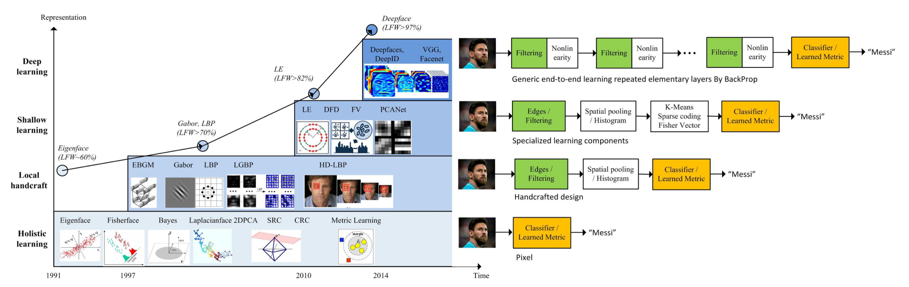
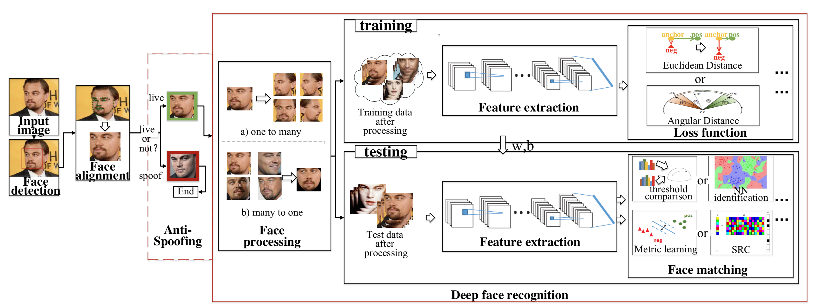

# Deep Face Recognition: A Survey

Mei Wang, Weihong Deng

School of Information and Communication Engineering, Beijing University of Posts and Telecommunications, Beijing, China.

## Abstract

* Summarize different network architectures and loss functions
* Categorize face processing methods into two classes.
  * "one-to-many augmentation"
  * "many-to-one normalization"
* Compare the commonly used database

## Introduction

* **The milestiones of feature-based Face Recognition**

  

  * The holistic approaches derive the low-dimensional representation (1990 ~ 2000)

    * Linear subspace
    * Manifold
    * Sparse representation
    * Fail to address the uncontrolled facial changes that deviate from their prior assumptions.
      

  * Local feature based Face Recognition (early 2000s)

    * Multilevel and high-dimensional extensions
      * Gabor
      * LBP
    * Handcrafted features suffered from a lack of distinctiveness and compactness.
      

  * Learning-based local descriptors (early 2010s)

    * One or two layer representation

    * Shallow representations still have an inevitable limitation on robustness against the complex nonlinear facial appearance variations.

  * Deep learning methods, CNN (2012~)

    * The hierarchical architecture of deep Face Recognition.
  
      
    
    * DeepFace (2014) : achieved the state-of-the-art accuracy on the famous LFW benchmark, approaching human performance on the unconstrained condition.

## OverView

* **Terminology**

  * Face verification
    * computes onte-to-one similarity
    
  * Face identification
    * computes one-to-many similarity to determine the specific identity of face.
      

* **Components of Face Recognition**
  $$
  M[F(P_i(I_i)), F(P_j(I_j))]
  $$
  

  * $$I_i, I_j$$ : two face images.
  * $$P$$ : stands for data processin to handle intra-personal variations.
  * $$F$$ : denotes feature extraction
  * $$M$$ : face matching algorithm. 

* **Face Processing**
  * One-to-many augmentation
    * Generating many patches or images of the pose variability from a single image to enable deep networks to learn pose-invariant representations.
  * Many-to-one normalization
    * Recovering the canonical view of face images from one or many images of a non frontal view.
  
* **Deep Feature Extraction**
  * Network Architecture
    * AlexNet
    * VGGNet
    * GoogleNet
    * ResNet
    * SENet
  
* **Loss Function**
  * For Face Recognition, when intra variations could be larger than inter-differences, the softmax loss is not sufficiently effective for Face Recognition.
  * Euclidean-distance-based loss
    * Compressing intra variance and enlarging inter-variance based on Euclidean distance.
  * Angular/cosine-margin-based loss
    * Learning discriminative face features in terms of angular similarity.
  * Softmax loss and its variations
    * Directly using softmax loss or modifying it to improve performance.
  
* **Face Matching**
  * Once the deep features are extracted, most methods directly calculate the similarity between two features using cosine distance or L2 distance.
  * Then, the nearest neighbor(NN) and threshold comparison are used for both identification and verification tasks.
  * Spare-representation-based classifier(SRC) perform the face matching efficiently and accurately.

## Evolution of Discriminative Loss Functions

